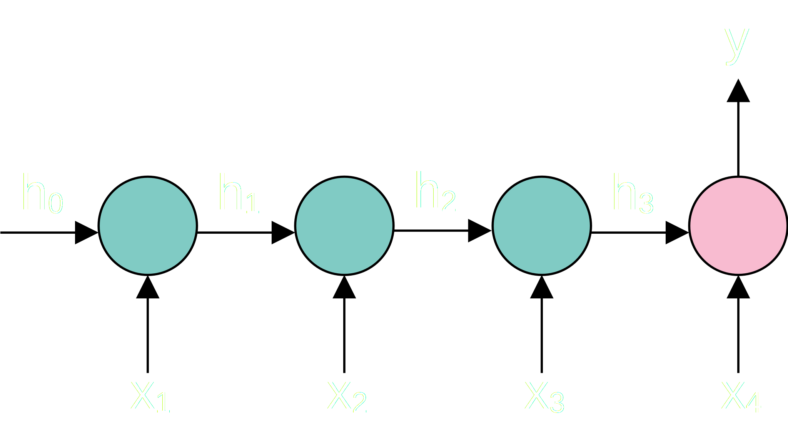
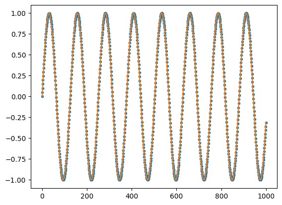
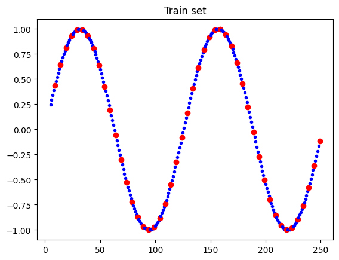
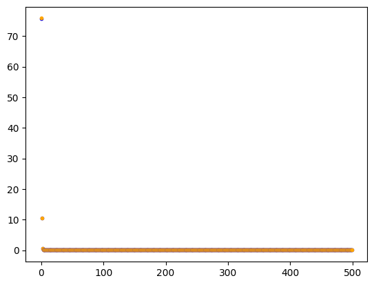
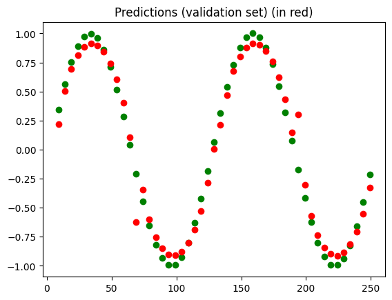

# vanillaRNN
RNN made from scratch, based on numpy, as a jupyter notebook. The network is tested on a $\textrm{sin}()$ function
## Cell structure

$g_1$ is $\textrm{tanh}()$ function

$g_2$ is $f(x)$ function

Comparing to the DL book, the adopted notation corresponds as follows: (image | this code | book)

$W_{aa} = W_{hh} = W$ (hidden-hidden)

$W_{ax} = W_{ih} = U$ (input-hidden)

$W_{ya} = W_{ho} = V$ (hidden-output)

## Network structure
This experimental network has 4 cells, organized as pictured:

The architecture is many-to-one, the cells colored in teal only output the hidden state ($h_t$), and the pink cell outputs ($y$), wich, in this example, corresponds to time $t=4$
## Experiments
#### Function
$f(x)=\textrm{sin}(x/20)$

#### Train set
Slice of function

#### Results
Losses per epoch

Predictions
